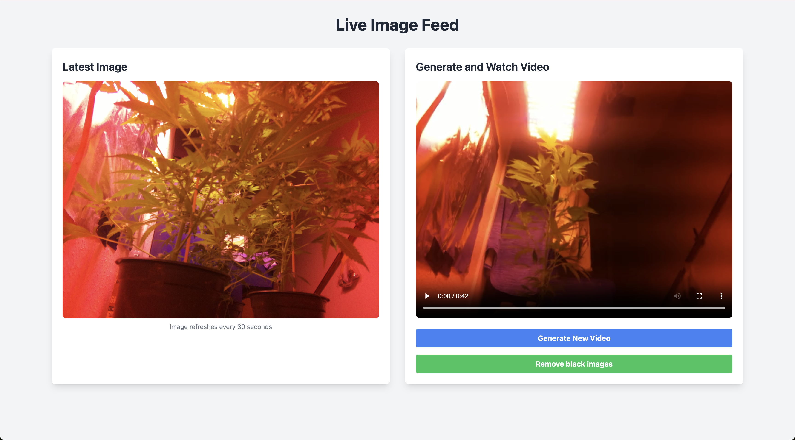

# 🚀 Pi-Cam: The Ultimate Timelapse & Stream App for Raspberry Pi


Welcome to **Pi-Cam**, the grooviest Raspberry Pi OS application that turns your wide-band cable camera into an epic timelapse and live stream machine! 🌱🌿 
Originally designed to track the magical growth of cannabis (legal in Germany, y'know 😉), it’s also perfect for capturing 3D prints, DIY projects, or anything that deserves to be immortalized in a timelapse. 

## 🌟 Features
- **🔴 Live Stream**: Watch your camera feed update every minute, in real-time, through a web interface.
- **📸 Timelapse Creation**: Capture stunning hourly snapshots and create mesmerizing timelapse videos with a single click.
- **🌍 Web Interface**: A slick web UI running on port `8808` where you can check out the current image and create a timelapse video from all the cool hourly images.
- **🎥 Perfect for Weed, Prints, and More**: Whether you’re into gardening, 3D printing, or any other project that needs to be watched in real-time, Pi-Cam’s got your back.

## 🚧 Architecture Breakdown

Pi-Cam is a beautiful symphony of 3 services that work together to make this happen:

1. **⏳ Timelapse Service**:  
   - Takes an image **every hour**.  
   - Images are stored permanently for future use in timelapse videos.  
   
2. **🎞 Stream Service**:  
   - Takes a snapshot **every minute**.  
   - The images are temporary and overwritten with each new one. (No storage bloat here!)  
  
3. **🌐 Web Service**:  
   - Hosts a cool web UI on port **8808**.  
   - See the latest live image and create timelapse videos from hourly snapshots with just a button click!

## 🏎 Getting Started: Fast & Furious

### 💻 Prerequisites
- A **Raspberry Pi** with Raspberry Pi OS installed.
- A wide-band cable camera (USB/CSI, whatever works for you!)

### 🔥 Installation & Setup

1. **Clone the repo**:  
   Go ahead and grab the Pi-Cam repo from GitHub:
   ```bash
   git clone https://github.com/Maxiboy441/pi-cam.git
   cd pi-cam
   ```
2. **Make the start script executable:**

   ```bash
   chmod +x ./start.sh
   ```
   **Start the party:**
   Run the following command and watch the magic happen. This will start all three services in the background:

   ```bash
   ./start.sh
   ```
   Your web interface will now be live at:

   ```bash
   http://<your-pi-ip>:8808
   ```
### 🌐 Web Interface: Your Personal Dashboard
   Once Pi-Cam is up and running, head over to your browser and type in http://<your-pi-ip>:8808. Here’s what you can do:

### 🖼 View the live stream:
 The current image updates every minute for a fresh view on your project.
 

### 🎬 Create a timelapse:
 Click the "Create Timelapse" button to stitch together all your hourly images into an epic timelapse video. Watch your growth, 3D print, or DIY project unfold in style!
### 🚨 Disclaimer
This project is all about having fun! 🎉 It’s a side project, so don't expect constant maintenance or support. However, feel free to fork it, play around, and customize it to your heart's content!

###### 💻 GitHub Repo: https://github.com/Maxiboy441/pi-cam.git

Now go ahead, get your Pi-Cam on, and let the world see what you're up to! 🌿🎥
